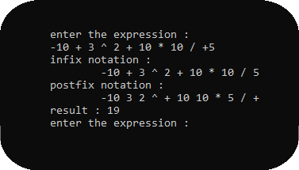

<p align="center">
  <h1>🧮 Posfix Calculator in C 🧮</h1>
  <h6>by <i>FranciscoCharles</i></h6>
</p>

This is an implementation of a calculator that converts infix notation to postfix and calculates the result of the expression, the code is written entirely in **C** and organized into easy-to-view modules. The calculator only accepts space-separated integers. You can use parentheses to organize your expressions. The calculator accepts additions, subitrations, multiplications, divisions, exponentiations and application of the mod operator, in addition to allowing the addition of signs to the number, if desired.

<p align="center">
    <figure>
        
        <figcaption>Figure 1 - example screen of program execution</figcaption>
    </figure>
</p>

# <a name=index>Table of contents 📚</a>

- [**How to use the calculator?**](#using_calculator)
- [**How can i run?**](#run)
- [**Version**](#version)
- [**License**](#license)

# **<a name=using_calculator>How to use the calculator 🕹️</a>**  <h6>[back to indice](#index)</h6>

The implemented calculator uses whole numbers, remember this when running. Each operand / operator must be separated by a space, additional spaces will be discarded.. You can use parentheses to organize expressions if you wish.
- example :
```c
1 + ( 3 * 2 ) * ( 6 / 2 ) = 19
```

  You can also add `+` or `-` to the beginning of a number to add a sign.
- example :
```c
1 + ( +3 * 2 ) * ( -6 * 2 ) = -17
```
  Use the following operators to create your expressions:

- use `*` to represent the multiplication operator.
- use `+` to represent the addition operator.
- use `-` to represent the subtraction operator.
- use `/` to represent the division operator.
- use `%` to represent the mod operator.
- use `^` to represent the exponentiation operator.

# **<a name=run>How can I run? 🧠💭</a>** <h6>[back to indice](#index)</h6>

go to the `src` folder and compile all the files. after that, run the generated program.

# **<a name=version>Version</a>**  <h6>[back to indice](#index)</h6>
- current version of the project: 1.0.1.

# **<a name=license>License</a>**  <h6>[back to indice](#index)</h6>

For more information on the license for this project read the <a href="./LICENSE" title="go to license file">LICENSE</a> file.

---

<p align="center">
    Copyright © 2021 <b>FranciscoCharles</b>
</p>